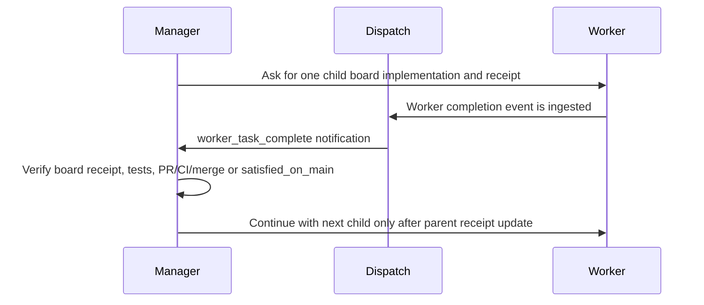
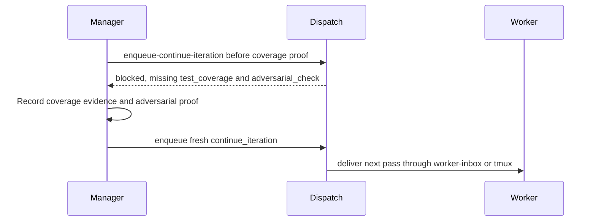
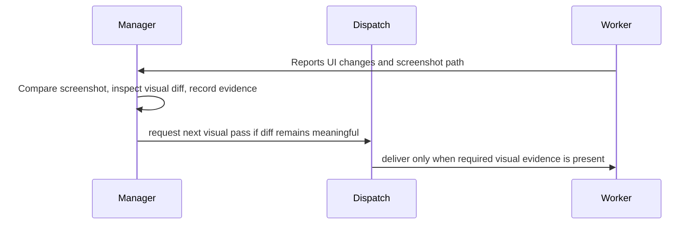
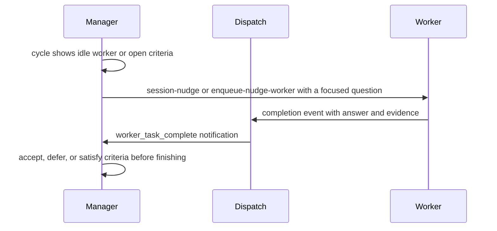
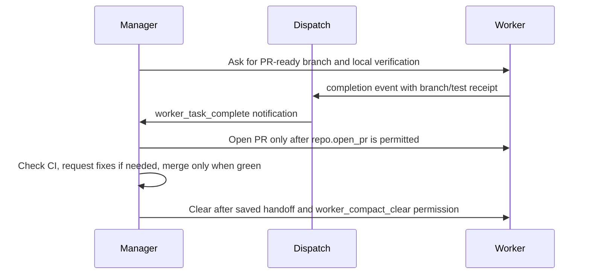

# Agent Conveyor Manager Recipes

Manager recipes are common supervision patterns for Agent Conveyor. They turn a
freeform setup conversation into concrete `manager-config` settings, loop
policy, permissions, evidence gates, and cleanup behavior.

The setup conversation can stay natural, but before a manager starts it should
resolve to one of these recipes or to an explicit `custom` configuration. The
manager should then show a locked setup summary and save the settings with
`conveyor manager-config`.

List the built-in recipes from the CLI:

```bash
conveyor manager-recipes --list --json
conveyor manager-recipes --show goalbuddy-conveyor --json
```

```text
Selected recipe: GoalBuddy Conveyor
Mode: strict
Permissions: repo.open_pr, repo.merge_green_pr, worker_session.compact, worker_session.clear
Tools: verification.run_tests, context.fetch_prs
Epilogues: draft-pr, record-handoff
Cleanup: compact between child boards after saved handoff
Evidence gates: child receipt, focused verification, adversarial review, PR/CI/merge or satisfied_on_main
Final report: record manager closeout proof separately from accepted worker criteria
Not allowed: merge without green CI; compact/clear before handoff; run two child boards at once
User confirmed: yes
```

## Runtime Notes

On Node releases where `node:sqlite` is still experimental, Conveyor commands
may print a SQLite `ExperimentalWarning` before otherwise valid JSON or status
output. Treat the process exit code and parsed JSON payload as the command
result, and keep the warning in receipts only when it obscures a real failure.

If a dogfood run reports `database is locked`, prefer retrying the Conveyor CLI
command after the active manager/worker write completes. Avoid direct SQLite
inspection while Dispatch is writing to the same `--path` database.

## Recipe Summary

| Recipe | Use When | Mode | Main Gates | Cleanup |
| --- | --- | --- | --- | --- |
| GoalBuddy Conveyor | Broad work should become sequential child boards | strict | child receipt, verification, adversarial review, PR/CI/merge or `satisfied_on_main` | optional compact after handoff |
| Test Coverage Loop | Worker should improve or prove test confidence | strict | `test_coverage`, `adversarial_check` | clear by default |
| UX Polish Loop | Worker should iterate on visible UI quality | guided or strict | screenshots, visual diff, browser evidence, `adversarial_check` | compact by default |
| Nudge / What's Next Manager | Manager should observe, ask status, and negotiate criteria | guided | manager decision, worker receipt, accepted criteria | off by default |
| PR/CI/Merge Ralph Loop | Manager should drive delivery through PR, CI, merge, handoff | strict | PR URL, green CI, merge receipt, adversarial proof | clear after handoff |
| Autonomous Ship-It Loop | Manager may push, open PRs, monitor CI, fix bounded conflicts, and merge | strict | branch, PR, CI, mergeability, manager decision, merge, post-merge, adversarial proof | clear after handoff |
| Creative Ops Campaign | One manager should supervise multiple Codex app worker slots for channel-specific creative assets | strict | campaign dashboard, slot lifecycle, assignment receipts, asset review receipts, human publish gate | rotate owned stale workers only |
| Campaign Duplicate-Guard Dogfood | Manager should prove campaign assignment receipts reject accidental duplicates in visible app sessions | strict | pre-probe dashboard, worker duplicate failure, post-probe dashboard, manager decision | off by default |

Two support patterns apply across recipes:

- **Inbox / No-Tmux App Loop**: use `manager-inbox` and `worker-inbox` when
  manager or worker sessions cannot receive tmux push delivery.
- **Recovery / Resume / Handoff**: use saved config, handoff, replay, audit,
  telemetry, and inbox state to resume a managed task safely.

Across all recipes, accepted criteria should describe worker/task deliverables.
Manager closeout mechanics such as `finish-task`, `--require-criteria-audit`,
final task state, heartbeat teardown, and final manager reporting are final
report or audit evidence. Do not seed them as accepted worker criteria unless
the task is explicitly Conveyor closeout QA.

## GoalBuddy Conveyor

Use this when the user says things like "make GoalBuddy boards", "run the
remaining work autonomously", "finish the translation", or "split this into
vertical slices".

Suggested setup:

```bash
conveyor manager-config "$TASK" \
  --mode strict \
  --objective "Run a one-child-at-a-time GoalBuddy conveyor until every child is merged, proven satisfied, or blocked with evidence." \
  --guideline "Keep exactly one child board active at a time." \
  --guideline "Before activating the next child, update the parent receipt." \
  --acceptance "Every child board has PR/CI/merge, satisfied_on_main, or blocker proof." \
  --acceptance "Parent state records final status for every child." \
  --permit repo.open_pr \
  --permit repo.merge_green_pr \
  --allow-worker-compact-clear \
  --tool verification.run_tests \
  --tool context.fetch_prs \
  --epilogue draft-pr \
  --epilogue record-handoff
```

Conversation storyboard:



Default rule: compact between child boards only after `conveyor handoff` records
the worker's current summary and `manager-permission worker_compact_clear
--require-handoff --require` passes.

## Test Coverage Loop

Use this when the user wants better tests, stronger coverage, or confidence
that a behavior is protected.

Suggested setup:

```bash
conveyor loop-templates --create-run "$TASK" \
  --template test_coverage_loop \
  --max-iterations 3 \
  --current-iteration 1 \
  --json

conveyor manager-config "$TASK" \
  --mode strict \
  --objective "Improve or prove test coverage for the requested behavior." \
  --acceptance "Coverage or targeted test evidence is recorded before another worker pass." \
  --acceptance "Structured adversarial proof names the strongest realistic failure mode." \
  --tool verification.run_tests \
  --permit worker_session.clear
```

Conversation storyboard:



## UX Polish Loop

Use this when the worker should refine visible quality, match a reference, or
repair a front-end interaction.

Suggested setup:

```bash
conveyor loop-templates --create-run "$TASK" \
  --template visual_diff_loop \
  --max-iterations 3 \
  --current-iteration 1 \
  --json

conveyor manager-config "$TASK" \
  --mode guided \
  --objective "Iterate on visible UI quality using browser and screenshot evidence." \
  --acceptance "Reference artifact, candidate screenshot, visual diff report, and below-threshold evidence are recorded." \
  --acceptance "Structured adversarial proof is recorded before another visual pass." \
  --tool verification.run_playwright \
  --allow-worker-compact-clear
```

Conversation storyboard:



## Nudge / What's Next Manager

Use this for low-risk observation, status checks, criteria negotiation, and
"what should happen next?" runs.

Suggested setup:

```bash
conveyor manager-config "$TASK" \
  --mode guided \
  --objective "Observe the worker, ask useful status and next-step questions, and finish only with evidence." \
  --guideline "Prefer wait over nudge while the worker is active." \
  --guideline "Ask for must-have current-task criteria versus follow-ups when scope changes." \
  --acceptance "Accepted criteria are satisfied or explicitly deferred." \
  --acceptance "The final summary names commands run, changed files, and residual risk."
```

Conversation storyboard:



## PR/CI/Merge Ralph Loop

Use this for managed delivery: PR readiness, CI monitoring, fix loops, green
merge, handoff, and fresh-worker replay.

Suggested setup:

```bash
conveyor manager-config "$TASK" \
  --mode strict \
  --objective "Drive the worker through PR readiness, CI, merge, handoff, and clear receipts." \
  --allow-pr \
  --allow-merge-green \
  --allow-worker-compact-clear \
  --epilogue draft-pr \
  --epilogue record-handoff \
  --tool verification.run_tests \
  --tool context.fetch_prs
```

Use `pr_ci_merge_loop` when a loop run is needed:

```bash
conveyor ralph-loop-presets --create-run "$TASK" \
  --preset pr_ci_merge_loop \
  --max-iterations 3 \
  --current-iteration 1 \
  --json
```

Conversation storyboard:



## Autonomous Ship-It Loop

Use this when the operator explicitly wants a manager-worker pair to ship a
bounded repo task through branch push, PR creation, CI monitoring, conflict
repair, and merge. This recipe is stricter than a PR/CI/Merge Ralph loop:
green CI is necessary, but never sufficient. The manager must also record a
fresh mergeability check, an explicit manager merge decision, the merge receipt,
post-merge verification, and structured adversarial proof.

Suggested setup:

```bash
conveyor loop-templates --create-run "$TASK" \
  --template ship_it_loop \
  --max-iterations 2 \
  --current-iteration 1 \
  --json

conveyor manager-config "$TASK" \
  --mode strict \
  --objective "Ship the bounded repo task through branch, PR, CI, conflict handling, manager merge decision, merge, and post-merge verification." \
  --acceptance "Branch, PR URL, green CI, clean mergeability, manager merge decision, merge receipt, post-merge verification, and adversarial proof are recorded before closeout." \
  --acceptance "Blocked conflict loops stop with retry count, last sanitized evidence, and next exact operator action." \
  --permit repo.push_branch \
  --permit repo.open_pr \
  --permit repo.monitor_ci \
  --permit repo.resolve_conflicts \
  --permit repo.merge_green_pr \
  --allow-worker-compact-clear \
  --tool verification.run_tests \
  --tool context.fetch_prs
```

Conversation storyboard:

```mermaid
sequenceDiagram
  participant M as Manager
  participant D as Dispatch
  participant W as Worker
  M->>W: Ask for bounded implementation and local proof
  W->>D: completion event with branch/test receipt
  D->>M: worker_task_complete notification
  M->>M: Verify diff, branch receipt, and push authority
  M->>M: Open PR only with repo.open_pr permission
  M->>M: Monitor CI and mergeability; request conflict fixes only within policy
  M->>M: Record explicit manager_merge_decision
  M->>M: Merge only with repo.merge_green_pr plus post-merge/adversarial proof
```

Fail closed on these conditions:

- no explicit permission for the requested repo side effect;
- CI green but mergeability, manager decision, or post-merge proof is missing;
- conflict retries reach the configured limit;
- a worker proposes merge based only on its own completion claim;
- the live manager/worker transcript is not reviewable through the app or tmux
  session.

Local proof:

```bash
conveyor qa-plan ship-it-loop
conveyor qa-run ship-it-loop --receipt-output /tmp/ship-it-loop-receipt.json --json
```

## Creative Ops Campaign

Use this when one manager should coordinate multiple Codex app worker sessions
for channel-specific creative work such as YouTube, TikTok, LinkedIn, Facebook,
image generation prompts, HyperFrames scripts, or reviewable copy drafts.
This recipe layers campaign state on top of ordinary manager/worker sessions:
workers remain visible app or tmux sessions, while the campaign record tracks
slots, channel briefs, assignments, asset receipts, blockers, and review state.

Suggested setup:

```bash
conveyor campaign create \
  --name "$CAMPAIGN" \
  --objective "Produce reviewable creative assets across named channels." \
  --json

conveyor campaign add-slot \
  --name "$CAMPAIGN" \
  --slot-key tiktok \
  --role-label "TikTok worker" \
  --channel tiktok \
  --thread-id "$TIKTOK_THREAD_ID" \
  --thread-title "TikTok Campaign Worker" \
  --state active \
  --json

conveyor campaign brief \
  --name "$CAMPAIGN" \
  --channel tiktok \
  --brief-json '{"format":"9:16","review_gate":"human approval before publish"}' \
  --json

conveyor dashboard --campaign "$CAMPAIGN" --ensure-dispatch
```

Manager operating loop:

```bash
conveyor campaign dashboard --name "$CAMPAIGN" --json
conveyor campaign assign --name "$CAMPAIGN" --slot "$SLOT_ID" \
  --title "Draft first-pass TikTok hooks" \
  --instructions "Create reviewable draft copy only; do not publish." \
  --status active --json
conveyor campaign asset --name "$CAMPAIGN" --slot "$SLOT_ID" \
  --assignment "$ASSIGNMENT_ID" --asset-type copy \
  --title "TikTok hooks v1" --status needs_review \
  --prompt-summary "Sanitized prompt summary only." --json
```

By default, an assignment can receive only one `campaign asset` receipt. If a
manager intentionally asks for variants or a revision under the same assignment,
the worker must add `--allow-additional-receipt` and explain why the extra
receipt is deliberate.

Evidence gates:

- `campaign dashboard --name "$CAMPAIGN" --json` shows every active worker
  slot, lifecycle state, blockers, approval counts, and `next_manager_action`.
- Each worker task has a slot-scoped `campaign assign` receipt before work
  starts and at least one `campaign asset` receipt before it can be reviewed.
- Human approval is required before public publishing, scheduling, or posting.
  Use `approved` or `published` asset receipt statuses only to record actual
  review outcomes; they are not permission to publish by themselves.
- Stale or context-heavy Codex app workers are rotated only through
  `campaign rotate-slot` with the exact current `--expected-thread-id`.
- Finished or replaced workers are archived only through `campaign archive-slot`
  with the exact current `--expected-thread-id`.

Fail closed on these conditions:

- the manager cannot see the worker slot in `campaign dashboard`;
- a worker thread id does not match the slot before rotate/archive;
- a worker asks to publish or schedule without explicit human approval;
- raw screenshots, private phone content, tokens, JWTs, keys, audio, or
  unsanitized transcripts would be committed as receipts;
- dogfood proof is missing but the manager tries to claim the campaign system
  is fully validated.

This recipe is ready for local dry runs and controlled dogfood. Treat final
dogfood success as a separate evidence task: the recipe can configure the loop,
but it does not by itself prove that a real campaign finished.

## Campaign Duplicate-Guard Dogfood

Use this when validating the campaign receipt guard in a visible Codex app
manager/worker setup. It is a narrower Creative Ops Campaign recipe: workers
create normal sanitized asset receipts first, then one worker deliberately
attempts an accidental duplicate receipt for the same assignment without
`--allow-additional-receipt`.

Suggested setup:

```bash
conveyor manager-recipes --show campaign-duplicate-guard-dogfood --json

conveyor manager-config "$TASK" \
  --mode strict \
  --objective "Supervise a visible campaign dogfood that proves duplicate assignment receipts fail closed without --allow-additional-receipt." \
  --guideline "Keep manager and worker sessions visibly chatty with CONVEYOR RECEIVED, WORK, and CONVEYOR SEND sections." \
  --guideline "Use campaign dashboard --name <campaign> --json as the supported receipt-listing surface." \
  --guideline "Ask exactly one worker to perform the missing-override duplicate probe, then require manager-side dashboard verification before closeout." \
  --acceptance "The campaign dashboard shows exactly one normal asset receipt for each active assignment before the duplicate probe." \
  --acceptance "A worker visibly attempts an accidental duplicate campaign asset receipt without --allow-additional-receipt and records the expected non-zero failure." \
  --acceptance "Manager independently verifies the post-probe dashboard still has the original asset_total, the probed slot still has one receipt, and blockers are empty." \
  --tool campaign.dashboard \
  --tool codex_app.send_message_to_thread
```

Manager operating loop:

```bash
conveyor campaign dashboard --name "$CAMPAIGN" --json
# Send one worker the duplicate probe without --allow-additional-receipt.
conveyor campaign dashboard --name "$CAMPAIGN" --json
```

Evidence gates:

- Pre-probe dashboard shows the expected active slots, assignment receipts, and
  exactly one normal asset receipt for each active assignment.
- The duplicate-probe worker transcript visibly reports the non-zero failure
  and the duplicate guard error text.
- Post-probe dashboard still shows the original `summary.asset_total`, the
  probed slot still has one `asset_receipts` count, and `blockers` is empty.
- The manager final report includes manager thread id, worker thread ids,
  assignment ids, original receipt ids, duplicate error text, pre/post dashboard
  counts, and cleanup status.

Fail closed on these conditions:

- the worker uses `--allow-additional-receipt` for the accidental duplicate
  probe;
- the manager repeats the worker's error text without verifying the dashboard;
- the operator or manager tries to inspect receipts with an unsupported
  `campaign assets` command instead of `campaign dashboard`;
- any worker tries to publish, schedule, contact external services, inspect
  private content, edit project files, or commit during the dogfood.

## Inbox / No-Tmux App Loop

When a manager or worker is a Codex app session without a tmux pane, Dispatch
records pull-required messages instead of pushing text into the session. The
manager should give the app session the relevant polling command:

```bash
conveyor worker-inbox "$TASK" --consume-next --wait --timeout 60 --json
conveyor manager-inbox "$TASK" --consume-next --wait --timeout 60 --json
```

Dispatch delivery is not a wake-up mechanism for idle Codex app threads. When
`communication.requires_polling=true`, install or verify a thread heartbeat for
each pull-required manager and worker session. The default heartbeat should run
about every two minutes, poll the role-specific inbox once with a short wait,
execute only a consumed item, and otherwise stop after a one-line idle receipt.
Do not delete or pause heartbeat automation because an inbox poll is idle; idle
polling is only a quiet interval. The manager or operator owns terminal loop
teardown. When all accepted criteria are satisfied, deferred, or rejected and
there is no next worker task, the manager should record the terminal decision,
run `conveyor finish-task "$TASK" --require-criteria-audit`, and explicitly
report heartbeat teardown status. If the task or binding still appears active,
report that as a control-plane blocker instead of calling the loop complete.
That closeout proof belongs in the manager final report or audit receipts, not
as a blocking accepted criterion for the worker.

For operator review, the live app or tmux session is the primary transcript.
Any consumed inbox item must be visible in that same session while the turn is
running: print `CONVEYOR POLL`, `CONVEYOR RECEIVED`, `WORK`, `CONVEYOR SEND`,
and `DISPATCH` sections. A one-line idle receipt is acceptable only when no
item is consumed.

When the manager is running in the Codex app and thread tools are available,
create fresh same-project manager and worker threads with `create_thread`, set
readable titles, and pass both ids/titles into `conveyor
create-disposable-binding` with `--manager-codex-app-thread-id`,
`--manager-codex-app-thread-title`, `--worker-codex-app-thread-id`, and
`--worker-codex-app-thread-title`. Use `send_message_to_thread` for bootstrap
prompts only; ongoing manager/worker communication should still be routed
through Dispatch and consumed from inboxes. If app thread tools are unavailable,
open the worker session manually and paste the same `worker_handoff` prompt.
Do not use `fork_thread` for this recipe unless the user explicitly wants a
fork of the current conversation.

### Codex App Native Manager/Worker Loop

```bash
conveyor doctor
conveyor db-doctor
conveyor create-disposable-binding "$TASK" \
  --worker "$WORKER" \
  --manager "$MANAGER" \
  --worker-codex-app-thread-id "$WORKER_THREAD_ID" \
  --worker-codex-app-thread-title "$WORKER_THREAD_TITLE" \
  --manager-codex-app-thread-id "$MANAGER_THREAD_ID" \
  --manager-codex-app-thread-title "$MANAGER_THREAD_TITLE" \
  --adversarial \
  --json
conveyor dispatch --watch --dispatcher-id dispatch-local
conveyor app-heartbeat "$TASK" --role manager --json
conveyor app-heartbeat "$TASK" --role worker --json
conveyor app-loop-status "$TASK" --json
conveyor app-wakeup-plan "$TASK" --json
conveyor app-wakeup-dispatch "$TASK" --json
conveyor app-autopilot start "$TASK" --json
```

Use `app-loop-status` as the operator status surface. If it reports stale
manager, worker, or Dispatch leases, use `app-wakeup-plan` to get the exact
thread prompt to send through Codex app automation or `send_message_to_thread`.
Use `app-autopilot start` from the operator session to record the pair-level
heartbeat policy and emit the exact Codex app heartbeat automation specs plus a
bounded Dispatch watch command. `app-autopilot stop` records the teardown policy
decision; it does not itself delete Codex app automations because that action
belongs to the Codex app automation layer.
The emitted heartbeat prompts include the visible-session protocol; do not
replace them with compact prompts that hide consumed work behind SQLite or
replay.
Each operator pulse should inspect `app-autopilot status --json`; if
`plan.quiescence.recommended_action` is `stop_autopilot`, record
`app-autopilot stop`, pause/delete the app heartbeat automations, and report the
blocked or idle state once instead of continuing to wake healthy sessions with
empty `next_actions`.
Use `app-wakeup-dispatch` when the manager needs a durable Conveyor receipt for
which app wake actions were prepared, skipped, or blocked. It only prepares
adapter-ready actions; direct app-thread delivery remains an app/operator
action, and Dispatch/inboxes remain the durable task state.
For loops created by `create-disposable-binding --json`, prefer the generated
`heartbeat_recommendations.wakeup_dispatch_command` and
`heartbeat_recommendations.delivery_receipt_commands` fields instead of
reconstructing those commands manually.
When running from a Codex app manager with thread tools available, send only
actions whose JSON has `send_ready=true` using `send_message_to_thread`, then
record each outcome with `app-wakeup-record-delivery` linked to the dispatch
receipt. Record healthy roles as `skipped` and missing-thread roles as
`blocked`; do not treat the app-thread send as task completion.

For worker context cleanup in Codex app sessions, prefer fresh-worker rotation
over remote slash commands. Run:

```bash
conveyor app-worker-rotation-plan "$TASK" \
  --old-worker-thread-id "$OLD_WORKER_THREAD_ID" \
  --require-handoff \
  --json
```

Only act on plans where `eligible=true`. First create the replacement worker
thread with the emitted prompt, then archive exactly the
`archive_old_worker_thread.thread.id` from the plan, and finally record the
result with the emitted `record_command`. Conveyor re-checks that the old thread
still belongs to the active bound worker before updating the worker session to
the new thread id. Never archive a manager thread, an unrelated worker thread,
or any thread id that did not come from the current rotation plan.

The saved dogfood example is
`docs/goals/live-codex-app-inbox-drill/notes/T001-live-drill.md`. It proves
manager-to-worker `nudge_worker` delivery and worker-to-manager
`worker_task_complete` delivery through pull-required inboxes.

## Recovery / Resume / Handoff

Use this when a manager attaches late, context compacts, a session restarts, or
the operator wants to know whether a task can safely continue.

Recommended commands:

```bash
conveyor cycle "$TASK"
conveyor replay "$TASK"
conveyor audit "$TASK" --json
conveyor telemetry --summary --task "$TASK"
conveyor handoff "$TASK" --summary "..." --next-step "..."
conveyor manager-permission "$TASK" worker_compact_clear --require-handoff --require
```

Recovery should prefer recorded state over chat memory. The manager should
inspect the saved manager config, active binding, latest handoff, open
acceptance criteria, command attempts, routed notifications, inbox backlog, and
telemetry before deciding whether to wait, nudge, continue, compact, clear, or
finish.

## Package Dogfood Command

Use a disposable workspace and explicit database path when checking the
package-facing `goalbuddy-conveyor` recipe flow. The point is to prove the
published package, not a local checkout.

```bash
mkdir -p /tmp/agent-conveyor-dogfood/workspace
git -C /tmp/agent-conveyor-dogfood/workspace init

conveyor pair \
  --task dogfood-goalbuddy \
  --worker-name dogfood-worker \
  --manager-name dogfood-manager \
  --task-goal "Dogfood the published package GoalBuddy conveyor recipe." \
  --task-prompt "Create docs/dogfood-note.md with a short received-task note and report a concise receipt." \
  --manager-recipe goalbuddy-conveyor \
  --manager-mode strict \
  --manager-objective "Run a one-child-at-a-time GoalBuddy conveyor until the disposable task is proven satisfied or blocked with evidence." \
  --manager-guideline "Keep exactly one child board active at a time." \
  --manager-guideline "Before activating the next child, update the parent receipt." \
  --manager-acceptance "The disposable worker task has a receipt showing the note file was created or a blocker was recorded." \
  --manager-acceptance "Manager config records the selected goalbuddy-conveyor recipe." \
  --manager-allow-worker-compact-clear \
  --manager-allow-pr \
  --manager-allow-merge-green \
  --manager-tool verification.run_tests \
  --manager-tool context.fetch_prs \
  --manager-epilogue draft-pr \
  --manager-epilogue record-handoff \
  --cwd /tmp/agent-conveyor-dogfood/workspace \
  --path /tmp/agent-conveyor-dogfood/workerctl.db \
  --accept-trust
```

Expected clean transcript shape:

```text
pair exits 0
dispatcher watch starts from an executable shipped with the package
manager_config.recipe_name = goalbuddy-conveyor
manager-ack and worker-ack are recorded against the same --path database
cycle shows worker_receipt for docs/dogfood-note.md
criteria --list shows all accepted criteria satisfied
finish-task --require-criteria-audit marks the task done
```

If a dogfood run needs an operator to add `--path`, find the active database, or
replace a missing source-tree path with the installed `workerctl` bin, the
package setup is not yet ready for unattended dogfooding. Record the friction in
the dogfood board so the next recipe or prompt pass has something concrete to
fix.

## What The Database Records

The SQLite control plane is the audit surface for these recipes.

| Table | Why It Matters |
| --- | --- |
| `manager_configs` | Saved recipe settings: `recipe_name`, mode, objective, guidelines, permissions, tools, epilogues, ack policy |
| `tasks`, `sessions`, `bindings` | Which manager and worker are bound to which task and where they run |
| `commands`, `command_attempts` | Manager requests, Dispatch claims, retries, blocks, and side-effect attempts |
| `routed_notifications` | Manager-to-worker and worker-to-manager messages, delivery mode, consumed state |
| `manager_cycles` | Observation history and manager context for each supervision pass |
| `acceptance_criteria` | Living criteria, proof, deferred follow-ups, rejected scope, satisfied evidence |
| `worker_handoffs` | Compact progress summaries and next steps before resume, compact, or clear |
| `runs` | Loop template metadata: max iterations, required evidence, cleanup policy |
| `telemetry_events` | Dispatch heartbeat, routing, failures, command health, searchable issue clues |
| `terminal_captures`, `transcript_captures`, `transcript_segments` | Optional forensic evidence for replay, export, and closeout |

This database makes recipe behavior reportable. A user can export a task and
show why a manager nudged, why Dispatch blocked a continuation, whether the
worker consumed the message, what proof satisfied a gate, and which setting
allowed or denied a risky action.

For maintainers, the same records turn dogfooding into product feedback. Repeated
PATH problems, stale Dispatch, noisy completion signals, missing handoffs,
unclear setup prompts, or overly broad permissions become visible patterns that
can be fixed in recipes, skills, docs, tests, or the dashboard.
