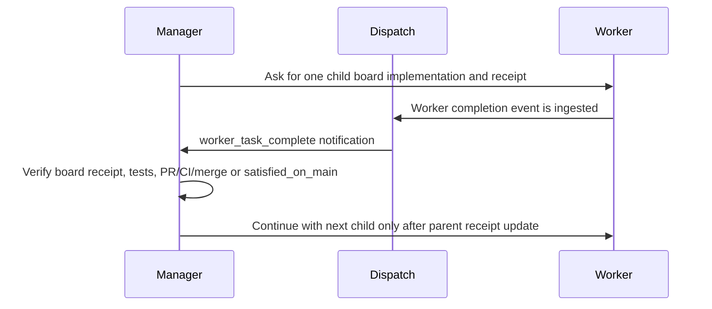
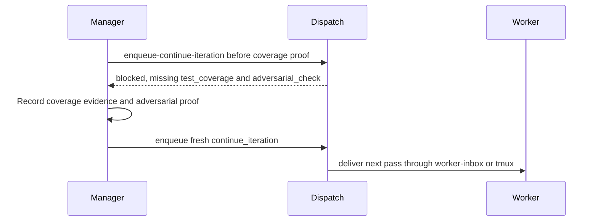
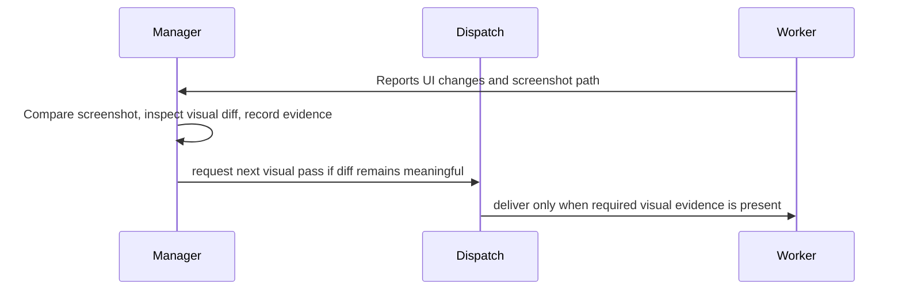
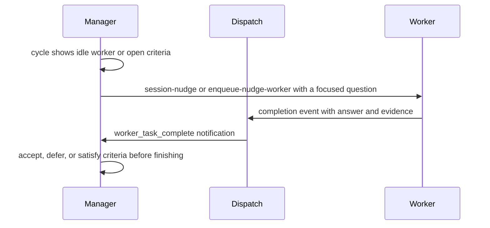
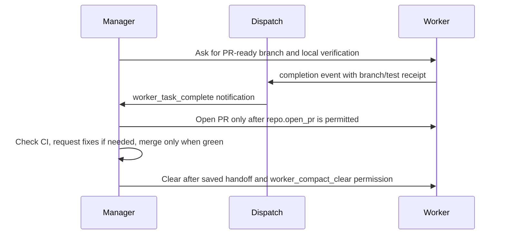

# Agent Conveyor Manager Recipes

Manager recipes are common supervision patterns for Agent Conveyor. They turn a
freeform setup conversation into concrete `manager-config` settings, loop
policy, permissions, evidence gates, and cleanup behavior.

The setup conversation can stay natural, but before a manager starts it should
resolve to one of these recipes or to an explicit `custom` configuration. The
manager should then show a locked setup summary and save the settings with
`conveyor manager-config`.

List the built-in recipes from the CLI:

```bash
conveyor manager-recipes --list --json
conveyor manager-recipes --show goalbuddy-conveyor --json
```

```text
Selected recipe: GoalBuddy Conveyor
Mode: strict
Permissions: repo.open_pr, repo.merge_green_pr, worker_session.compact, worker_session.clear
Tools: verification.run_tests, context.fetch_prs
Epilogues: draft-pr, record-handoff
Cleanup: compact between child boards after saved handoff
Evidence gates: child receipt, focused verification, adversarial review, PR/CI/merge or satisfied_on_main
Not allowed: merge without green CI; compact/clear before handoff; run two child boards at once
User confirmed: yes
```

## Runtime Notes

On Node releases where `node:sqlite` is still experimental, Conveyor commands
may print a SQLite `ExperimentalWarning` before otherwise valid JSON or status
output. Treat the process exit code and parsed JSON payload as the command
result, and keep the warning in receipts only when it obscures a real failure.

If a dogfood run reports `database is locked`, prefer retrying the Conveyor CLI
command after the active manager/worker write completes. Avoid direct SQLite
inspection while Dispatch is writing to the same `--path` database.

## Recipe Summary

| Recipe | Use When | Mode | Main Gates | Cleanup |
| --- | --- | --- | --- | --- |
| GoalBuddy Conveyor | Broad work should become sequential child boards | strict | child receipt, verification, adversarial review, PR/CI/merge or `satisfied_on_main` | optional compact after handoff |
| Test Coverage Loop | Worker should improve or prove test confidence | strict | `test_coverage`, `adversarial_check` | clear by default |
| UX Polish Loop | Worker should iterate on visible UI quality | guided or strict | screenshots, visual diff, browser evidence, `adversarial_check` | compact by default |
| Nudge / What's Next Manager | Manager should observe, ask status, and negotiate criteria | guided | manager decision, worker receipt, accepted criteria | off by default |
| PR/CI/Merge Ralph Loop | Manager should drive delivery through PR, CI, merge, handoff | strict | PR URL, green CI, merge receipt, adversarial proof | clear after handoff |

Two support patterns apply across recipes:

- **Inbox / No-Tmux App Loop**: use `manager-inbox` and `worker-inbox` when
  manager or worker sessions cannot receive tmux push delivery.
- **Recovery / Resume / Handoff**: use saved config, handoff, replay, audit,
  telemetry, and inbox state to resume a managed task safely.

## GoalBuddy Conveyor

Use this when the user says things like "make GoalBuddy boards", "run the
remaining work autonomously", "finish the translation", or "split this into
vertical slices".

Suggested setup:

```bash
conveyor manager-config "$TASK" \
  --mode strict \
  --objective "Run a one-child-at-a-time GoalBuddy conveyor until every child is merged, proven satisfied, or blocked with evidence." \
  --guideline "Keep exactly one child board active at a time." \
  --guideline "Before activating the next child, update the parent receipt." \
  --acceptance "Every child board has PR/CI/merge, satisfied_on_main, or blocker proof." \
  --acceptance "Parent state records final status for every child." \
  --permit repo.open_pr \
  --permit repo.merge_green_pr \
  --allow-worker-compact-clear \
  --tool verification.run_tests \
  --tool context.fetch_prs \
  --epilogue draft-pr \
  --epilogue record-handoff
```

Conversation storyboard:



Default rule: compact between child boards only after `conveyor handoff` records
the worker's current summary and `manager-permission worker_compact_clear
--require-handoff --require` passes.

## Test Coverage Loop

Use this when the user wants better tests, stronger coverage, or confidence
that a behavior is protected.

Suggested setup:

```bash
conveyor loop-templates --create-run "$TASK" \
  --template test_coverage_loop \
  --max-iterations 3 \
  --current-iteration 1 \
  --json

conveyor manager-config "$TASK" \
  --mode strict \
  --objective "Improve or prove test coverage for the requested behavior." \
  --acceptance "Coverage or targeted test evidence is recorded before another worker pass." \
  --acceptance "Structured adversarial proof names the strongest realistic failure mode." \
  --tool verification.run_tests \
  --permit worker_session.clear
```

Conversation storyboard:



## UX Polish Loop

Use this when the worker should refine visible quality, match a reference, or
repair a front-end interaction.

Suggested setup:

```bash
conveyor loop-templates --create-run "$TASK" \
  --template visual_diff_loop \
  --max-iterations 3 \
  --current-iteration 1 \
  --json

conveyor manager-config "$TASK" \
  --mode guided \
  --objective "Iterate on visible UI quality using browser and screenshot evidence." \
  --acceptance "Reference artifact, candidate screenshot, visual diff report, and below-threshold evidence are recorded." \
  --acceptance "Structured adversarial proof is recorded before another visual pass." \
  --tool verification.run_playwright \
  --allow-worker-compact-clear
```

Conversation storyboard:



## Nudge / What's Next Manager

Use this for low-risk observation, status checks, criteria negotiation, and
"what should happen next?" runs.

Suggested setup:

```bash
conveyor manager-config "$TASK" \
  --mode guided \
  --objective "Observe the worker, ask useful status and next-step questions, and finish only with evidence." \
  --guideline "Prefer wait over nudge while the worker is active." \
  --guideline "Ask for must-have current-task criteria versus follow-ups when scope changes." \
  --acceptance "Accepted criteria are satisfied or explicitly deferred." \
  --acceptance "The final summary names commands run, changed files, and residual risk."
```

Conversation storyboard:



## PR/CI/Merge Ralph Loop

Use this for managed delivery: PR readiness, CI monitoring, fix loops, green
merge, handoff, and fresh-worker replay.

Suggested setup:

```bash
conveyor manager-config "$TASK" \
  --mode strict \
  --objective "Drive the worker through PR readiness, CI, merge, handoff, and clear receipts." \
  --allow-pr \
  --allow-merge-green \
  --allow-worker-compact-clear \
  --epilogue draft-pr \
  --epilogue record-handoff \
  --tool verification.run_tests \
  --tool context.fetch_prs
```

Use `pr_ci_merge_loop` when a loop run is needed:

```bash
conveyor ralph-loop-presets --create-run "$TASK" \
  --preset pr_ci_merge_loop \
  --max-iterations 3 \
  --current-iteration 1 \
  --json
```

Conversation storyboard:



## Inbox / No-Tmux App Loop

When a manager or worker is a Codex app session without a tmux pane, Dispatch
records pull-required messages instead of pushing text into the session. The
manager should give the app session the relevant polling command:

```bash
conveyor worker-inbox "$TASK" --consume-next --wait --timeout 60 --json
conveyor manager-inbox "$TASK" --consume-next --wait --timeout 60 --json
```

The saved dogfood example is
`docs/goals/live-codex-app-inbox-drill/notes/T001-live-drill.md`. It proves
manager-to-worker `nudge_worker` delivery and worker-to-manager
`worker_task_complete` delivery through pull-required inboxes.

## Recovery / Resume / Handoff

Use this when a manager attaches late, context compacts, a session restarts, or
the operator wants to know whether a task can safely continue.

Recommended commands:

```bash
conveyor cycle "$TASK"
conveyor replay "$TASK"
conveyor audit "$TASK" --json
conveyor telemetry --summary --task "$TASK"
conveyor handoff "$TASK" --summary "..." --next-step "..."
conveyor manager-permission "$TASK" worker_compact_clear --require-handoff --require
```

Recovery should prefer recorded state over chat memory. The manager should
inspect the saved manager config, active binding, latest handoff, open
acceptance criteria, command attempts, routed notifications, inbox backlog, and
telemetry before deciding whether to wait, nudge, continue, compact, clear, or
finish.

## What The Database Records

The SQLite control plane is the audit surface for these recipes.

| Table | Why It Matters |
| --- | --- |
| `manager_configs` | Saved recipe settings: `recipe_name`, mode, objective, guidelines, permissions, tools, epilogues, ack policy |
| `tasks`, `sessions`, `bindings` | Which manager and worker are bound to which task and where they run |
| `commands`, `command_attempts` | Manager requests, Dispatch claims, retries, blocks, and side-effect attempts |
| `routed_notifications` | Manager-to-worker and worker-to-manager messages, delivery mode, consumed state |
| `manager_cycles` | Observation history and manager context for each supervision pass |
| `acceptance_criteria` | Living criteria, proof, deferred follow-ups, rejected scope, satisfied evidence |
| `worker_handoffs` | Compact progress summaries and next steps before resume, compact, or clear |
| `runs` | Loop template metadata: max iterations, required evidence, cleanup policy |
| `telemetry_events` | Dispatch heartbeat, routing, failures, command health, searchable issue clues |
| `terminal_captures`, `transcript_captures`, `transcript_segments` | Optional forensic evidence for replay, export, and closeout |

This database makes recipe behavior reportable. A user can export a task and
show why a manager nudged, why Dispatch blocked a continuation, whether the
worker consumed the message, what proof satisfied a gate, and which setting
allowed or denied a risky action.

For maintainers, the same records turn dogfooding into product feedback. Repeated
PATH problems, stale Dispatch, noisy completion signals, missing handoffs,
unclear setup prompts, or overly broad permissions become visible patterns that
can be fixed in recipes, skills, docs, tests, or the dashboard.
