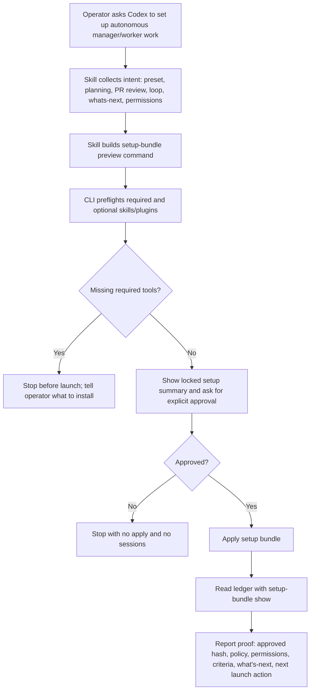

# Setup Concierge Skill Implementation Plan

> **For agentic workers:** REQUIRED SUB-SKILL: Use superpowers:subagent-driven-development (recommended) or superpowers:executing-plans to implement this plan task-by-task. Steps use checkbox (`- [ ]`) syntax for tracking.

**Goal:** Turn `conveyor-setup-bundle` into a conversational Codex-session setup concierge for autonomous manager/worker operating cells.

**Architecture:** Keep setup as a skill-driven Codex conversation, not a visual app wizard. The skill gathers operator intent, maps choices to `conveyor setup-bundle` flags, previews and preflights required tools, halts on missing required plugins/skills, asks for explicit approval, applies the bundle, then proves the saved ledger configuration with `setup-bundle show`.

**Tech Stack:** Agent Conveyor CLI, TypeScript runtime tests, plugin skill packaging, Markdown skill instructions.

---

## File Structure

- Modify `plugin/agent-conveyor/skills/conveyor-setup-bundle/SKILL.md`
  - Expand the current thin command guide into the conversational setup protocol.
  - Include setup modes, intake questions, backend-to-flag mappings, preview/apply/show flow, halt rules, and handoff rules.
- Modify `src/cli/typescript-runtime.test.ts`
  - Strengthen plugin install tests so the installed skill must contain the conversational protocol and the required safety phrases.
  - Add an optional targeted test that proves a configured required PR-review backend blocks when its skill is missing.
- Modify `docs/manager-recipes.md`
  - Clarify that setup bundles are intended to be driven from a Codex session via the setup skill, with visual/app UI as a future secondary surface.

## Workflow Shape



## Task 1: Upgrade the Setup Skill Into a Conversational Protocol

**Files:**
- Modify: `plugin/agent-conveyor/skills/conveyor-setup-bundle/SKILL.md`
- Test: `src/cli/typescript-runtime.test.ts`

- [ ] **Step 1: Write the skill-install expectations first**

In `src/cli/typescript-runtime.test.ts`, extend the existing `setupBundleSkill` assertions in the plugin install test:

```ts
const setupBundleSkill = readFileSync(join(codexHome, "skills", "conveyor-setup-bundle", "SKILL.md"), "utf8");
assert.match(setupBundleSkill, /conveyor setup-bundle preview/);
assert.match(setupBundleSkill, /conveyor setup-bundle apply/);
assert.match(setupBundleSkill, /conveyor setup-bundle show/);
assert.match(setupBundleSkill, /If a required backend is missing, stop\. Do not create sessions/);
assert.match(setupBundleSkill, /Conversation Protocol/);
assert.match(setupBundleSkill, /Intake Questions/);
assert.match(setupBundleSkill, /Review Rigor/);
assert.match(setupBundleSkill, /What's Next Nudging/);
assert.match(setupBundleSkill, /Ralph Loop/);
assert.match(setupBundleSkill, /--pr-review-backend/);
assert.match(setupBundleSkill, /--planning-backend/);
assert.match(setupBundleSkill, /--whats-next-max-iterations/);
assert.match(setupBundleSkill, /--loop-preset/);
assert.match(setupBundleSkill, /Do not launch manager or worker sessions until `conveyor setup-bundle show` confirms an applied bundle/);
```

- [ ] **Step 2: Run the focused test to verify it fails**

Run:

```bash
npm test -- src/cli/typescript-runtime.test.ts --test-name-pattern "Agent Conveyor plugin install"
```

Expected: fail because the installed `conveyor-setup-bundle` skill does not yet contain `Conversation Protocol`, `Intake Questions`, and the other new protocol markers.

- [ ] **Step 3: Replace the skill body with the concierge protocol**

Replace `plugin/agent-conveyor/skills/conveyor-setup-bundle/SKILL.md` with:

```markdown
---
name: conveyor-setup-bundle
description: Draft, preflight, apply, and inspect Agent Conveyor setup bundles for manager-worker operating cells through a conversational Codex setup flow.
---

# Conveyor Setup Bundle

Use this skill when the operator wants to configure a manager/worker pair or
worker set with explicit planning, loop, PR review, what's-next, permissions,
and evidence policy before launch.

## Rules

- Use `.codex-workers/workerctl.db` under the current project unless the
  operator explicitly provides another path.
- Run `conveyor setup-bundle preview` before `apply`.
- If a required backend is missing, stop. Do not create sessions, bindings, or
  work prompts.
- Ask for explicit operator approval before `conveyor setup-bundle apply`.
- Treat `conveyor setup-bundle show` as the ledger truth for what setup policy
  was approved.
- Do not launch manager or worker sessions until `conveyor setup-bundle show`
  confirms an applied bundle.

## Conversation Protocol

Guide setup as a Codex-session conversation, not as a visual app wizard.

1. Confirm or create the Conveyor task.
2. Ask only the missing intake questions needed to build a setup bundle.
3. Translate the answers into `conveyor setup-bundle preview` flags.
4. Show the locked setup summary from the preview JSON.
5. If `preflight.missing_required` is non-empty, stop and tell the operator
   exactly which required skills or plugins need installation.
6. If preflight passes, ask whether to apply this exact setup.
7. Apply only with `--approve`.
8. Run `conveyor setup-bundle show` and report ledger proof.
9. Hand off to launch skills only after the ledger readback proves the bundle is
   applied.

## Intake Questions

Ask these in plain language and skip anything the operator has already answered:

- Setup type: autonomous ship-it, test coverage Ralph Loop, UX Ralph Loop,
  PR/CI/merge Ralph Loop, or custom.
- Planning and goalsetting: direct prompt, `codex_goal`, `goalbuddy`, or custom.
- Review Rigor: off, `codex_review`, `superpowers`, GitHub, security, composite,
  or custom.
- Ralph Loop: none, ship-it, test coverage, UX/visual diff, PR/CI/merge, or
  custom loop preset.
- What's Next Nudging: off, suggest only, or execute bounded.
- What's Next iteration cap: integer max iteration count.
- Post-merge What's Next: whether nudging may continue after a successful merge.
- Manager authority: confirm push branch, open PR, monitor CI, resolve bounded
  conflicts, merge green PR, compact/clear worker sessions.
- Worker setup: number of workers, role profile, sandbox expectation, approval
  policy, and whether review is required before handoff.

## Preset Mapping

Use these defaults unless the operator chooses custom settings:

| Operator intent | Flags |
| --- | --- |
| Autonomous ship-it | `--preset autonomous_ship_it` |
| Test coverage Ralph Loop | `--preset test_coverage_ralph` |
| UX Ralph Loop | `--preset ux_polish_ralph` |
| PR/CI/merge Ralph Loop | `--preset pr_ci_merge_ralph` |
| Custom | `--preset custom` plus explicit backend flags |

## Backend Mapping

Planning flags:

| Choice | Flags |
| --- | --- |
| Direct prompt | `--planning-backend direct_prompt` |
| Codex goal drafter | `--planning-backend codex_goal` |
| GoalBuddy | `--planning-backend goalbuddy --planning-required` |
| Custom | `--planning-backend custom --planning-required --require-skill <skill>` |

Review Rigor flags:

| Choice | Flags |
| --- | --- |
| Off | `--pr-review-backend off` |
| Codex autoreview / closeout review | `--pr-review-backend codex_review --pr-review-required` |
| Superpowers review | `--pr-review-backend superpowers --pr-review-required` |
| GitHub review | `--pr-review-backend github --pr-review-required` |
| Security review | `--pr-review-backend security --pr-review-required` |
| Composite review | `--pr-review-backend composite --pr-review-required` |
| Custom review | `--pr-review-backend custom --pr-review-required --require-skill <skill>` |

Ralph Loop flags:

| Choice | Flags |
| --- | --- |
| None | `--loop-backend none` |
| Ship-it | `--loop-backend ralph_loop --loop-preset ship_it_loop` |
| Test coverage | `--loop-backend ralph_loop --loop-preset test_coverage_loop` |
| UX / visual diff | `--loop-backend ralph_loop --loop-preset visual_diff_loop` |
| PR/CI/merge | `--loop-backend ralph_loop --loop-preset pr_ci_merge_loop` |
| Custom | `--loop-backend custom --loop-preset <preset>` |

What's Next Nudging flags:

| Choice | Flags |
| --- | --- |
| Off | `--whats-next off --whats-next-max-iterations 0` |
| Suggest only | `--whats-next suggest_only --whats-next-max-iterations <n>` |
| Execute bounded | `--whats-next execute_bounded --whats-next-max-iterations <n>` |
| Allow post-merge | add `--whats-next-post-merge` |

## Commands

Create the task when needed:

```bash
TASK="example-task"
LEDGER="$PWD/.codex-workers/workerctl.db"

conveyor tasks --create "$TASK" \
  --goal "Configure an autonomous manager-worker setup before launch." \
  --path "$LEDGER" \
  --json
```

Preview the exact setup:

```bash
conveyor setup-bundle preview "$TASK" \
  --preset autonomous_ship_it \
  --pr-review-backend composite \
  --pr-review-required \
  --planning-backend goalbuddy \
  --planning-required \
  --whats-next execute_bounded \
  --whats-next-max-iterations 1 \
  --whats-next-post-merge \
  --path "$LEDGER" \
  --json
```

If required tools are missing, stop here. Do not run `apply`, do not create
manager/worker sessions, and do not weaken the configured backend silently.

After explicit approval, apply:

```bash
conveyor setup-bundle apply "$TASK" \
  --preset autonomous_ship_it \
  --pr-review-backend composite \
  --pr-review-required \
  --planning-backend goalbuddy \
  --planning-required \
  --whats-next execute_bounded \
  --whats-next-max-iterations 1 \
  --whats-next-post-merge \
  --approve \
  --path "$LEDGER" \
  --json
```

Read back ledger truth:

```bash
conveyor setup-bundle show "$TASK" \
  --path "$LEDGER" \
  --json
```

## Report Format

After `show`, report:

- preset
- planning backend and required skills
- PR review backend, gate, and required skills
- Ralph Loop backend, preset, max iterations, and required evidence
- What's Next mode, max iterations, and post-merge setting
- manager permissions and denied actions
- worker profile summary
- approved hash
- seeded acceptance criteria count, when present
- exact next action

## Handoff

Only after `show` confirms `state: "applied"`:

- Use `conveyor-create-pair` for one manager/worker pair.
- Use `conveyor-create-worker-set` for a manager with multiple workers.
- Use `conveyor-whats-next-nudger` only when the bundle enables What's Next
  nudging.

If `show` returns `blocked`, missing required tools, or no setup bundle, tell the
operator setup is not launch-ready and list the missing proof.
```

- [ ] **Step 4: Run the focused plugin install test**

Run:

```bash
npm test -- src/cli/typescript-runtime.test.ts --test-name-pattern "Agent Conveyor plugin install"
```

Expected: pass.

- [ ] **Step 5: Commit**

```bash
git add plugin/agent-conveyor/skills/conveyor-setup-bundle/SKILL.md src/cli/typescript-runtime.test.ts
git commit -m "docs: expand setup bundle skill protocol"
```

## Task 2: Prove Configured Review Rigor Blocks When Required Tools Are Missing

**Files:**
- Modify: `src/cli/typescript-runtime.test.ts`
- Test: `src/cli/typescript-runtime.test.ts`

- [ ] **Step 1: Add a CLI test for required configurable PR review**

Add this test near the existing setup-bundle CLI tests:

```ts
test("setup-bundle preview blocks configurable required PR review when skill is missing", () => {
  const root = mkdtempSync(join(tmpdir(), "agent-conveyor-cli-setup-bundle-review-required."));
  try {
    const dbPath = join(root, "workerctl.db");
    const codexHome = join(root, "codex-home");
    const created = runTypescriptRuntimeCommand({
      args: ["tasks", "--create", "review-required-task", "--goal", "Require review rigor.", "--path", dbPath, "--json"],
      env: {},
    });
    assert.equal(created.exitCode, 0, created.stderr);

    const preview = runTypescriptRuntimeCommand({
      args: [
        "setup-bundle",
        "preview",
        "review-required-task",
        "--preset",
        "custom",
        "--pr-review-backend",
        "superpowers",
        "--pr-review-required",
        "--codex-home",
        codexHome,
        "--path",
        dbPath,
        "--json",
      ],
      env: {},
    });
    assert.equal(preview.exitCode, 0, preview.stderr);
    const payload = JSON.parse(preview.stdout ?? "{}") as {
      preflight: { missing_required: string[]; ok: boolean };
      policy: { pr_review: { backend: string; required: boolean; required_skills: string[] } };
    };
    assert.equal(payload.policy.pr_review.backend, "superpowers");
    assert.equal(payload.policy.pr_review.required, true);
    assert.ok(payload.policy.pr_review.required_skills.includes("superpowers:requesting-code-review"));
    assert.equal(payload.preflight.ok, false);
    assert.ok(payload.preflight.missing_required.includes("superpowers:requesting-code-review"));

    const proofDb = new DatabaseSync(dbPath);
    try {
      assert.equal((proofDb.prepare("select count(*) as count from setup_bundles").get() as { count: number }).count, 0);
    } finally {
      proofDb.close();
    }
  } finally {
    rmSync(root, { recursive: true, force: true });
  }
});
```

- [ ] **Step 2: Run the targeted test**

Run:

```bash
npm test -- src/cli/typescript-runtime.test.ts --test-name-pattern "configurable required PR review"
```

Expected: pass. This proves preview exposes the missing required review skill and does not mutate the setup ledger.

- [ ] **Step 3: Add the blocked apply counterpart**

Extend the same test after the preview assertions:

```ts
const apply = runTypescriptRuntimeCommand({
  args: [
    "setup-bundle",
    "apply",
    "review-required-task",
    "--preset",
    "custom",
    "--pr-review-backend",
    "superpowers",
    "--pr-review-required",
    "--approve",
    "--codex-home",
    codexHome,
    "--path",
    dbPath,
    "--json",
  ],
  env: {},
});
assert.equal(apply.exitCode, 1, apply.stderr);
const appliedPayload = JSON.parse(apply.stdout ?? "{}") as {
  blocked: boolean;
  launched: boolean;
  missing_required: string[];
  setup_bundle: { state: string; blocked_reason: string | null };
};
assert.equal(appliedPayload.blocked, true);
assert.equal(appliedPayload.launched, false);
assert.ok(appliedPayload.missing_required.includes("superpowers:requesting-code-review"));
assert.equal(appliedPayload.setup_bundle.state, "blocked");
assert.match(appliedPayload.setup_bundle.blocked_reason ?? "", /missing required backend/);
```

Update the ledger assertion to expect one blocked `setup_bundles` record after apply:

```ts
assert.equal((proofDb.prepare("select count(*) as count from setup_bundles where state = 'blocked'").get() as { count: number }).count, 1);
assert.equal((proofDb.prepare("select count(*) as count from manager_configs").get() as { count: number }).count, 0);
```

- [ ] **Step 4: Run the targeted test again**

Run:

```bash
npm test -- src/cli/typescript-runtime.test.ts --test-name-pattern "configurable required PR review"
```

Expected: pass.

- [ ] **Step 5: Commit**

```bash
git add src/cli/typescript-runtime.test.ts
git commit -m "test: prove setup review rigor preflight blocks"
```

## Task 3: Document the Conversational Surface

**Files:**
- Modify: `docs/manager-recipes.md`
- Test: direct inspection with `rg`

- [ ] **Step 1: Update setup bundle docs**

In `docs/manager-recipes.md`, replace the first paragraph under `## Setup Bundles` with:

```markdown
`conveyor setup-bundle` is the preferred high-level setup surface when the
operator needs planning, Ralph-style loops, PR review rigor, what's-next
nudging, permissions, and evidence gates configured together. The primary UX is
a Codex-session setup conversation driven by the `conveyor-setup-bundle` skill:
the agent asks only the missing setup questions, previews the bundle, halts on
missing required tools, asks for approval, applies the bundle, and reads the
ledger back with `setup-bundle show`. Manager recipes remain the reusable preset
metadata; setup bundles compile those recipes into a locked, preflighted ledger
record before manager/worker launch.
```

- [ ] **Step 2: Verify the docs mention the intended surface**

Run:

```bash
rg -n "Codex-session setup conversation|conveyor-setup-bundle|setup-bundle show" docs/manager-recipes.md plugin/agent-conveyor/skills/conveyor-setup-bundle/SKILL.md
```

Expected: both the docs and skill file mention the Codex-session flow and ledger readback.

- [ ] **Step 3: Commit**

```bash
git add docs/manager-recipes.md
git commit -m "docs: clarify setup bundle session workflow"
```

## Task 4: Closeout Verification

**Files:**
- Inspect: `plugin/agent-conveyor/skills/conveyor-setup-bundle/SKILL.md`
- Inspect: `docs/manager-recipes.md`
- Test: `src/cli/typescript-runtime.test.ts`

- [ ] **Step 1: Run focused setup-bundle tests**

Run:

```bash
npm test -- src/cli/typescript-runtime.test.ts --test-name-pattern "setup-bundle|Agent Conveyor plugin install"
```

Expected: pass.

- [ ] **Step 2: Run lint and build**

Run:

```bash
npm run lint
npm run build
```

Expected: both pass.

- [ ] **Step 3: Disprove the strongest realistic failure mode**

Failure mode: the skill claims to enforce configurable PR review rigor, but an operator can configure `superpowers` review without the plugin installed and still get a launch-ready manager authority record.

Run the targeted test:

```bash
npm test -- src/cli/typescript-runtime.test.ts --test-name-pattern "configurable required PR review"
```

Expected evidence:

- preview reports `preflight.ok: false`
- preview reports `missing_required` containing `superpowers:requesting-code-review`
- preview creates no `setup_bundles` row
- apply with `--approve` exits `1`
- apply records only a blocked `setup_bundles` row
- apply creates no `manager_configs` row
- apply reports `launched: false`

- [ ] **Step 4: Inspect the final diff**

Run:

```bash
git diff --check
git diff --stat HEAD~3..HEAD
git diff HEAD~3..HEAD -- plugin/agent-conveyor/skills/conveyor-setup-bundle/SKILL.md docs/manager-recipes.md src/cli/typescript-runtime.test.ts
```

Expected: no whitespace errors; diff is limited to the skill, docs, and focused tests.

- [ ] **Step 5: Final handoff**

Use this final shape:

```text
Claim: The setup bundle skill now drives a conversational Codex-session setup workflow for autonomous manager/worker cells.
Disproof attempt: Configured required Superpowers PR review without the Superpowers skill installed, then tried preview/apply.
Evidence: <targeted test command and result>; preview/apply assertions showed missing required skill, no manager authority, no launch.
Residual risk: <none known, or a specific follow-up such as adding first-class multi-worker count flags if needed>.
```

## Acceptance Criteria

- `conveyor-setup-bundle` describes a conversational setup flow rather than a visual app wizard.
- The skill explicitly supports configurable planning, PR review rigor, Ralph Loop setup, and What's Next nudging.
- The skill explicitly says required missing backends halt setup before launch.
- The skill requires preview before apply and `show` ledger readback before launch.
- Tests prove the installed plugin skill contains the protocol and flag mappings.
- Tests prove required configurable PR review cannot silently become launch-ready when the required skill is missing.
- Docs clarify the Codex-session setup surface.
