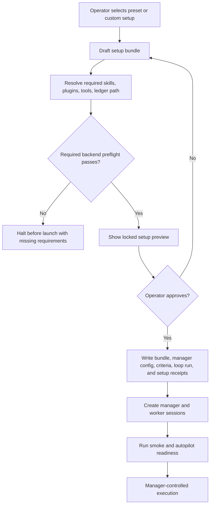

# Setup Bundle Workflow Design

## Summary

Agent Conveyor should add a first-class setup bundle workflow for creating
manager/worker operating cells. The bundle is a previewable and auditable
configuration object that compiles operator intent, recipes, permissions,
worker profiles, loop policy, planning policy, PR review rigor, what's-next
nudging, and evidence gates before any manager or worker is launched.

The current plugin tranche can create visible Codex app pairs or worker sets
and check status. Manager recipes can seed manager config, permissions, tools,
epilogues, and acceptance criteria. The setup bundle should sit above those
pieces: it chooses and validates the whole operating policy, halts when required
backends are missing, writes durable ledger receipts, then launches sessions
only after the locked setup summary is approved.

## Goals

- Support general manager/worker setup, not only autonomous ship-it.
- Make autonomous ship-it a flagship preset built on the general setup bundle.
- Support Ralph-style loop presets for test coverage, UX polish, PR/CI/merge,
  ship-it, and future loop templates.
- Make planning and goalsetting configurable through direct prompts, durable
  `/goal` statements, GoalBuddy boards, or custom backends.
- Make PR review rigor configurable and enforceable through required skills or
  plugins such as Superpowers, Codex Review, GitHub workflows, and Codex
  Security.
- Make what's-next nudging an explicit optional phase for every workflow,
  including bounded post-merge follow-up work when permitted.
- Halt before launch when a required backend, skill, plugin, permission, or
  ledger preflight is missing.
- Record setup policy, backend preflight, operator approval, and all authority
  grants in the ledger.

## Non-Goals

- Do not replace manager recipes. Recipes become templates that produce setup
  bundles.
- Do not make ship-it assumptions global. Ship-it is one preset.
- Do not silently degrade to weaker review, planning, or loop behavior when a
  required backend is missing.
- Do not require every setup to use GoalBuddy, Codex Review, GitHub, or Codex
  Security. These are configurable backends.
- Do not launch workers before required setup proof is recorded.

## Setup Bundle Model

The setup bundle is the source of truth for an operating cell. It should be
drafted, preflighted, previewed, approved, persisted, and then used to launch
the manager and workers.

```yaml
setup_bundle:
  name: autonomous-ship-it-example
  preset: autonomous_ship_it
  manager:
    mode: strict
    permissions:
      - repo.push_branch
      - repo.open_pr
      - repo.monitor_ci
      - repo.resolve_conflicts
      - repo.merge_green_pr
      - worker_session.compact
      - worker_session.clear
    denied_actions:
      - "Do not merge before CI, mergeability, manager decision, and post-merge proof."
      - "Do not compact or clear before a saved handoff."
  workers:
    count: 1
    profiles:
      - role: implementer
        sandbox: workspace-write
        approval: on-request
        branch_policy: codex-prefixed-branch
        evidence_contract: ship_it_worker_receipt
  planning:
    backend: goalbuddy
    required: true
  loop:
    backend: ralph_loop
    preset: ship_it_loop
    max_iterations: 2
  pr_review:
    backend: composite
    required: true
  whats_next:
    enabled: true
    max_iterations: 1
    post_merge_allowed: true
  evidence:
    acceptance_criteria: []
    closeout_requires_disproof_attempt: true
```

The exact serialized shape can evolve during implementation, but the policy
blocks should remain peers:

- `manager`
- `workers`
- `planning`
- `loop`
- `pr_review`
- `whats_next`
- `evidence`
- `preflight`
- `approval`

## Workflow



The halt branch is part of the product contract. If a setup requires
`superpowers:requesting-code-review`, `goalbuddy:goal-prep`, `codex-review`, or
another backend that is not available, setup must stop before sessions start and
before action authority is granted.

Example blocker:

```text
Setup blocked: required backend missing.

Missing:
- superpowers:requesting-code-review
- superpowers:receiving-code-review

Install or enable the required plugin, then rerun setup.
No manager or workers were launched.
No task authority was granted.
```

An operator may intentionally weaken a policy only by editing the bundle and
approving a new locked summary. The system should record that weaker approval in
the ledger.

## Planning Policy

Planning and goalsetting should be a configurable backend. The setup bundle
does not always need a GoalBuddy board, but long-running autonomous work should
prefer one.

Supported planning backends:

| Backend | Use When | Required Proof |
| --- | --- | --- |
| `direct_prompt` | Small, bounded manager/worker tasks | Prompt saved in setup receipt |
| `codex_goal` | Work needs a durable `/goal` statement but not a board | Goal text with acceptance criteria, verification, and stop rule |
| `goalbuddy` | Broad, autonomous, long-running, multi-worker, or ship-it work | GoalBuddy board or starter command, goal oracle, task receipts, final audit rule |
| `custom` | Project-specific planning workflow | Named backend contract and explicit preflight |

For `goalbuddy`, the setup should be able to require:

- goal oracle;
- local board creation or an explicit opt-out;
- one active task;
- Worker `allowed_files`, `verify`, and `stop_if`;
- Scout/Judge/Worker receipts;
- final Judge or PM audit before completion.

Autonomous ship-it should default to `planning.backend: goalbuddy` when the
backend is available and configured as required.

## Loop Policy

Ralph-style loop setup must be a first-class bundle policy, not a ship-it-only
detail.

Supported loop backends:

| Backend | Use When |
| --- | --- |
| `none` | Single-pass manager/worker run |
| `ralph_loop` | Manager-controlled iterations using known Ralph presets |
| `loop_template` | Existing generic loop template metadata |
| `custom` | Project-specific loop policy |

Initial loop presets should include:

- `test_coverage_loop`: require coverage or targeted test evidence and
  adversarial proof before another pass.
- `visual_diff_loop`: require reference artifact, candidate screenshot, visual
  diff report, threshold proof, and adversarial proof.
- `pr_ci_merge_loop`: require PR URL, green CI, merge receipt, handoff, and
  adversarial proof.
- `ship_it_loop`: require branch, push, PR, CI, mergeability, manager merge
  decision, merge, post-merge verification, and adversarial proof.

Loop continuation should be blocked by missing required evidence, exhausted
iteration budgets, manager stop decisions, or out-of-scope follow-up work.

## PR Review Policy

PR review rigor should be configurable and enforceable from worker setup. This
matters because target repositories may not have rigorous review expectations
built in.

Supported review backends:

| Backend | Role |
| --- | --- |
| `codex_review` | Local second-model review using the `codex-review` skill/helper |
| `superpowers` | Behavioral workflow for requesting and receiving review rigorously |
| `github` | PR metadata, review comments, review-thread follow-up, and CI inspection |
| `security` | Security-sensitive diff scanning through Codex Security |
| `composite` | Recommended strict mode combining multiple engines |
| `custom` | Project-specific review contract |

Recommended autonomous ship-it default:

```yaml
pr_review:
  backend: composite
  required: true
  workflow_skill: superpowers:requesting-code-review
  reception_skill: superpowers:receiving-code-review
  engines:
    - codex-review
    - github:gh-address-comments
    - github:gh-fix-ci
  optional_engines:
    - codex-security:security-diff-scan
  security_scan: auto
  manager_gate: block_merge_until_review_receipts
```

Required review receipts should include:

- review requested;
- review command or review workflow used;
- actionable findings accepted or rejected with rationale;
- accepted findings fixed;
- focused verification after review fixes;
- unresolved GitHub review threads addressed or explicitly deferred;
- manager review decision before merge;
- security scan receipt or explicit not-applicable rationale when security scan
  is `auto` or `always`.

Workers may run review tools, but merge authority remains manager-gated. The
manager must treat worker review claims as claims until ledger receipts support
them.

## What's-Next Policy

What's-next nudging should be an explicit optional phase in every setup bundle.
It runs only after the current plan has been successfully and measurably
executed.

```yaml
whats_next:
  enabled: true
  mode: execute_bounded # off | suggest_only | execute_bounded
  max_iterations: 1
  trigger: after_verified_success
  approver: manager
  scope_rule: narrow_reversible_in_scope
  post_merge_allowed: true
  stop_rule:
    - max_iterations_exhausted
    - insufficient_evidence
    - out_of_scope
    - manager_recommends_stop
```

For autonomous ship-it, post-merge what's-next work is allowed when:

- the bundle enables `post_merge_allowed`;
- the follow-up slice is narrow, reversible, and in scope;
- repo permissions still cover the needed side effects;
- review and loop evidence gates still apply;
- the iteration budget has not been exhausted.

If `mode: suggest_only`, the manager records follow-up suggestions but does not
execute them. If `mode: off`, verified success moves directly to closeout.

## Presets

The first setup bundle presets should be:

- `nudge_whats_next`: minimal authority, guided status and criteria closure.
- `test_coverage_ralph`: `codex_goal` by default, optional GoalBuddy planning,
  plus test coverage loop.
- `ux_polish_ralph`: `codex_goal` by default, optional GoalBuddy planning, plus
  visual evidence loop with browser/screenshot proof.
- `pr_ci_merge_ralph`: PR/CI/merge loop without the full autonomous ship-it
  authority surface.
- `autonomous_ship_it`: strict planning, review, repo permissions, CI,
  mergeability, post-merge proof, and optional post-merge what's-next nudging.
- `custom`: operator-selected policy blocks with explicit backend preflight.

Recipes should become preset templates that fill bundle defaults. The locked
preview should still show every permission, required backend, denied action,
evidence gate, loop budget, review backend, planning backend, and what's-next
policy before launch.

## Ledger And Audit Records

The setup bundle should write durable records for:

- bundle draft hash and approved hash;
- preset and policy block selections;
- backend preflight results;
- missing-backend blockers;
- manager config revision;
- seeded acceptance criteria;
- loop run or template metadata;
- worker profile prompts and authority;
- PR review requirements;
- what's-next policy;
- operator approval;
- launch receipt;
- smoke/autopilot readiness receipt.

Add a dedicated `setup_bundles` table for approved bundle revisions and use
existing tables such as `manager_configs`, `acceptance_criteria`, `runs`,
`bindings`, `commands`, `command_attempts`, `worker_handoffs`, and telemetry
events for runtime state derived from that bundle. The dedicated table should
store draft hash, approved hash, serialized policy blocks, preflight result,
approval state, and timestamps so replay, diffing, blocked attempts, and bundle
revision history do not depend on reconstructing scattered telemetry.

## Error Handling

- Missing required backend: halt before launch, report exact missing skills or
  plugins, record the blocked setup attempt in `setup_bundles`, and record no
  manager/worker launch, binding, or action authority grants.
- Optional backend missing: continue only if the bundle marks it optional and
  the locked preview shows the missing optional backend.
- Invalid permission: halt before ledger write.
- Unknown loop preset: halt before launch.
- Missing ledger path or unwritable ledger: halt before launch.
- Partial launch after successful preflight: record which sessions were created
  and which binding or readiness step failed.
- Operator weakens policy after a blocker: require a new locked preview and
  explicit approval.

## Testing And Proof

Focused tests should prove:

- setup bundle preview includes planning, loop, PR review, what's-next,
  permissions, denied actions, and evidence gates;
- required backend preflight halts before launching sessions when a configured
  skill or plugin is missing;
- optional backend preflight reports warnings without blocking;
- ship-it preset includes strict repo permissions, review gates, post-merge
  proof, and what's-next defaults;
- test coverage and UX Ralph presets create the expected loop metadata and
  required evidence gates;
- weakening a required backend policy requires an explicit new approval;
- ledger receipts can reconstruct why a manager was allowed or blocked from
  pushing, opening a PR, monitoring CI, merging, compacting, clearing, or
  continuing a what's-next iteration.

Dogfood proof should include an adversarial check: configure a setup requiring
Superpowers or GoalBuddy with that backend intentionally unavailable, then prove
no manager, worker, binding, or authority grant is created.
